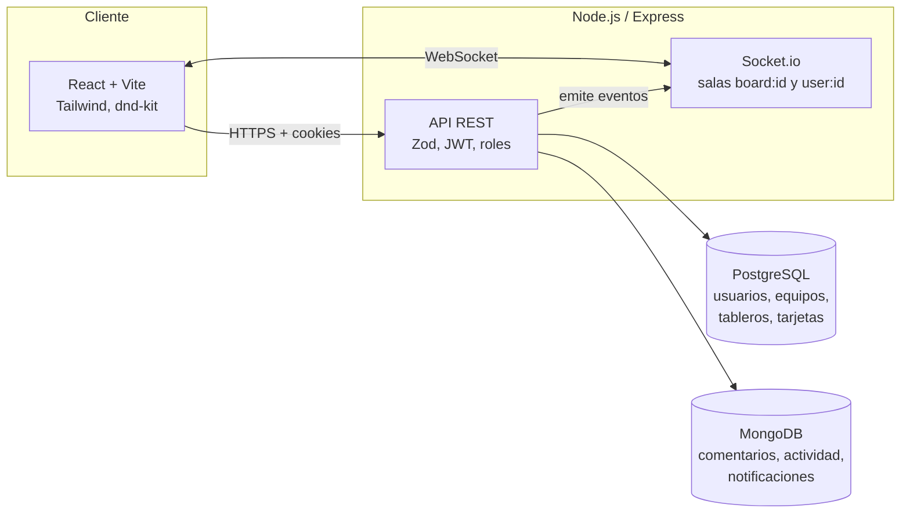

# FlowBoard

Gestión de proyectos estilo Trello/Asana: equipos con roles, tableros kanban con tarjetas arrastrables, comentarios con menciones, feed de actividad y notificaciones en tiempo real.

**Demo en vivo:** _(agregar URL de Vercel)_ · **API:** _(agregar URL de Railway)_

<!-- Agregar capturas o un GIF del tablero en uso: docs/screenshot-board.png -->

## Funcionalidades

- **Autenticación:** registro/login con JWT (access + refresh con rotación) en cookies `httpOnly`; la sesión se renueva sola cuando el access token vence.
- **Equipos y roles:** owner / admin / member. El owner gestiona roles; owner y admin invitan, expulsan y borran tableros. Un admin no puede expulsar a otro admin.
- **Tableros kanban:** columnas y tarjetas con descripción, fecha límite y asignados; **drag & drop** entre columnas con orden persistente (`@dnd-kit`).
- **Tiempo real (Socket.io):** los cambios de un usuario aparecen al instante en el tablero de los demás.
- **Comentarios y actividad:** comentarios por tarjeta y feed de actividad por tablero (MongoDB).
- **Notificaciones:** al asignarte una tarjeta o mencionarte con `@email` en un comentario, con contador de no leídas en vivo.
- **Búsqueda** de tarjetas y **paginación por cursor** de notificaciones.

## Arquitectura



**Por qué dos bases de datos:** el núcleo del dominio (usuarios, equipos, membresías, tableros, columnas, tarjetas) tiene relaciones fuertes y se modela en **PostgreSQL** con SQL parametrizado (sin ORM). Comentarios, log de actividad y notificaciones son de escritura frecuente, sin relaciones complejas y con estructura variable según el tipo de evento — encajan mejor en **MongoDB**. Como no hay `JOIN` ni `CASCADE` entre bases, la integridad entre ambas se resuelve en la capa de aplicación (p. ej. al borrar una tarjeta se borran sus comentarios).

## Stack

| Capa | Tecnología |
|---|---|
| Frontend | React 19, Vite 6, TailwindCSS 4, React Router 7, dnd-kit, socket.io-client |
| Backend | Node.js 22, Express 5, Socket.io, Zod, bcryptjs, jsonwebtoken |
| Datos | PostgreSQL (`pg`), MongoDB (Mongoose) |
| Tests | Vitest + Supertest (backend), Vitest + React Testing Library (frontend) |
| Despliegue | Vercel (frontend), Railway (backend), Neon (Postgres), MongoDB Atlas |

## Correr en local

Requisitos: Node 22+, una base PostgreSQL y una MongoDB (por ejemplo los planes gratuitos de [Neon](https://neon.tech) y [Atlas](https://www.mongodb.com/atlas)).

```bash
git clone https://github.com/iJhonX/flowboard.git
cd flowboard
npm run install:all

cp backend/.env.example backend/.env     # completar variables
cp frontend/.env.example frontend/.env

npm run db:init --prefix backend         # crea las tablas (idempotente)
npm run dev                              # backend :4000 + frontend :5173
```

### Variables de entorno

**`backend/.env`**

| Variable | Descripción |
|---|---|
| `PORT` | Puerto del servidor (default 4000) |
| `DATABASE_URL` | Connection string de PostgreSQL |
| `MONGODB_URI` | Connection string de MongoDB |
| `JWT_SECRET` / `JWT_REFRESH_SECRET` | Secretos distintos y largos; generar con `node -e "console.log(require('crypto').randomBytes(48).toString('hex'))"` |
| `CLIENT_URL` | Origen del frontend (CORS, sockets y chequeo de Origin) |
| `NODE_ENV` | `production` en despliegue (activa cookies `secure` + `sameSite=none`) |

**`frontend/.env`** — `VITE_API_URL` y `VITE_SOCKET_URL` (URL del backend; se leen en tiempo de build).

## Tests

```bash
npm test --prefix backend    # 38 tests: auth, CRUD, permisos, defensa CSRF
npm test --prefix frontend   # 12 tests: AuthContext, rutas protegidas, formularios
```

Los tests de backend son de integración y usan las bases configuradas en `backend/.env`: cada archivo crea sus propios usuarios y los borra al terminar. Usá una base de pruebas, no la de producción.

## Despliegue

1. **Bases de datos:** crear el proyecto en Neon y el cluster en Atlas; guardar ambas connection strings. Ejecutar `npm run db:init --prefix backend` una vez apuntando a la base de producción.
2. **Backend en Railway:** nuevo proyecto desde este repo, *Root Directory* `backend` (usa `backend/railway.json`). Variables: `NODE_ENV=production`, `DATABASE_URL`, `MONGODB_URI`, `JWT_SECRET`, `JWT_REFRESH_SECRET`, `CLIENT_URL` (se completa en el paso 4). Generar un dominio público y verificar `https://<dominio>/api/health`.
3. **Frontend en Vercel:** importar el repo, *Root Directory* `frontend`. Variables: `VITE_API_URL` y `VITE_SOCKET_URL` = URL pública del backend. `frontend/vercel.json` hace el rewrite del router de SPA.
4. Volver a Railway y poner `CLIENT_URL` = URL de Vercel (sin `/` final), luego redeploy.
5. En Atlas, *Network Access*: Railway usa IPs dinámicas, por lo que hay que permitir `0.0.0.0/0` (la conexión sigue protegida por usuario/contraseña y TLS) o usar un plan de Railway con IP estática.

### Notas de seguridad

- Las cookies de sesión son `httpOnly`; en producción `secure` + `sameSite=none` porque frontend y backend están en dominios distintos. Para compensar la pérdida de protección CSRF de `sameSite=lax`, toda petición que cambia estado debe venir del origen configurado en `CLIENT_URL` (middleware `requireAllowedOrigin`) y CORS está restringido a ese origen.
- Los errores 500 nunca exponen detalles internos al cliente; se registran solo en el servidor.
- El refresh token es stateless: cerrar sesión borra las cookies pero no invalida el token emitido (mejora pendiente: lista de revocación).

## Estructura

```
backend/   API Express, sockets, modelos Mongoose, esquema SQL, tests
frontend/  App React (pages, components, context, api), tests
.github/   CI (lint, tests, build)
```

## Licencia

Proyecto de portafolio.
